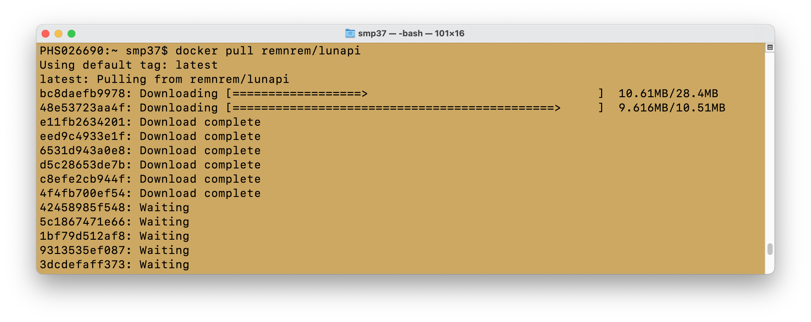

# LunAPI: A Python interface for Luna

This repository contains tutorial and reference notebooks for LunAPI
(pronounced _luna-py_), a Python-based interface for the
[Luna](http://zzz.bwh.harvard.edu/luna/) C/C++ toolset for the
analysis of sleep signal data.

## Getting started

While we develop the `lunapi` Python package, we are primarily
supporting a Docker-based installation.  This ensures that the same
functionality is available on all platforms (Windows, macOS and Linux)
and allows `lunapi` to be bundled with a set of associated models and
resources (e.g. tutorial data, staging models, etc) embedded within a
Jupyter Lab interactive notebook environment.

> [!NOTE]
> We will soon be distributing binary wheels for all major
> platforms and Python versions via PyPI.  In the mean time,
> experienced users are free to compile the project locally
> (installing [Luna] and [LunaAPI](http://github.com/remnrem/luna-api)
> and building themselves (e.g. invoking the scikit-build-core/CMake
> build system, with the Luna library pre-installed).  Notes on this
> process will be added in the future: for now, this Docker version is
> the suggested way to get started.

### 1) Install Docker Desktop

 

### 2) Pull the latest LunAPI image

 

### 3) Get the tutorial and reference notebooks

 

### 4) Start LunAPI 

Move to the folder you downloaded the notebooks to and start _LunAPI_.

 

 

This will start a container running a Jupyter Lab notebook environment, with Luna and
associated data and models all pre-installed. 

 

## More information

The main Luna documentation pages can be found at
[http://zzz.bwh.harvard.edu], which describes how to work with Luna,
its command scripting language and the range of commands available.

Currently, all documentation related to the Python interface
(specifically _LunAPI_, or the Python package `lunapi`) are in the
Jupyter notebooks in this repository.

